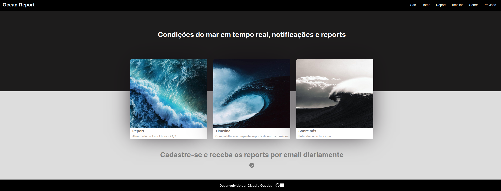
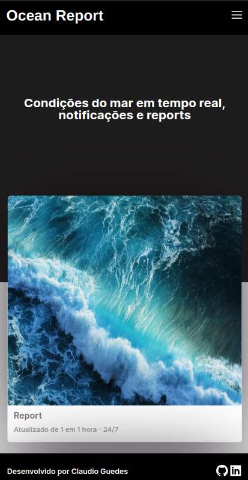

<div align="center">
  <h1>OCEAN REPORT v1.0</h1>
  <br> 
  Ocean Report é um software feito para gerenciar reports das condições oceânicas das praias do Rio de Janeiro. Os reports são feitos através de um algoritmo alimentado com base nos dados em tempo real de uma boia meteo-oceanográfica. Além disso, também é possível receber os reports diretamente por email, e compartilhar suas próprias observações sobre as condições oceânicas na sua região com outros usuários através da nossa timeline. Esse é um projeto full stack. <a href = "https://github.com/guedesclaudio/oceanreport-backend">Repositório do back-end</a>
  <br>
  <br>
  
  <br>
  <br>
  
</div>
<br>
  
# Funcionalidades
- Fluxo de login e cadastro
- Opção de receber reports por email
- Acompanhar reports de outros usuários
- Compartilhar o seu próprio report
- Acesso a previsão de tempo e mar com link externo (Windy)

# Pŕoximas atualizações para v2.0
- Login federado com opção de Github e Google
- Filtro de palavras ofensivas ao postar uma publicação
- Opção de poder avaliar a acertividade do algoritmo que gera o report
- Opção do usuário poder gerenciar sua conta
- Configuração do Docker
- Realizar CI/CD com deploy AWS

# Stack principal Frontend
- React
- TypeScript
- Syled-components
- Vercel
- Git
- Linux

# Como rodar
1. Clone esse repositório
2. Instale as dependências:
```bash
npm i
```
3. Inicie a aplicação:
```bash
npm run start
```
<br>